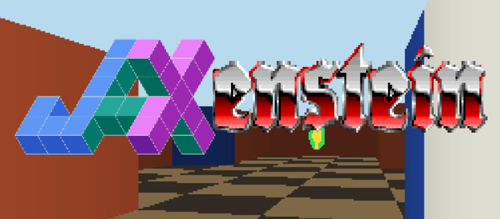

<p align="center">
 
</p>

# JAXenstein

First-person maze environments in JAX.

Features: ASCII maps, RGB raycast observations, billboard sprites, colored keys
and doors, sparse goal rewards, health survival, and JIT/vmap-friendly environment steps. The full details of this benchmark are given in the [preprint](https://arxiv.org/abs/2605.19926).

<p align="center">
 
</p>

## Install

You can install the JAXenstein repo through `pip`:

```bash
pip install git+https://github.com/taodav/jaxenstein.git
```

For local development and scripts:

```bash
git clone https://github.com/taodav/jaxenstein.git
cd jaxenstein
pip install -e ".[dev]"
```

## Environments

Use an ID with `make_jaxenstein_env`, `make_jaxenstein_gymnax_env`, or
`jaxenstein-play --maze {ID}`. The complete ID list is exported as
`jaxenstein.JAXENSTEIN_ENV_IDS`.

| Group | Environment | ID | Description |
| --- | --- | --- | --- |
| Basic | Simple | `simple` | Small navigation task with one start and one goal. |
| Basic | Key-door | `key-door` | Collect a red key, open a red door, reach the goal. |
| MiniGrid | KeyCorridorS4R3 | `key-corridor` | 3-by-3 room key corridor with colored doors and a locked goal room. |
| Health | Health Gathering | `health-gathering` | Survive an acidic room by collecting medkits. |
| Maze | My Way Home | `my-way-home` | Large maze with many starts, colored walls, and one goal. |
| Maze | My Way Home Colorless | `my-way-home-colorless` | Same topology with default wall coloring. |
| DMLab | Static goal | `dmlab-static-{01,02,03}` | Fixed-goal mazes; `01` small, `02` medium, `03` large. |
| DMLab | Random goal | `dmlab-random-{01,02,03}` | Same sizes; one goal candidate is active each episode. |

## Python Usage

```python
import jax
import jax.numpy as jnp

from jaxenstein import ACTION_MOVE_FORWARD, JAXENSTEIN_ENV_IDS, make_jaxenstein_env

env = make_jaxenstein_env("simple")
obs, state = env.reset(jax.random.key(0))
obs, state, reward, done, info = env.step(state, ACTION_MOVE_FORWARD)

print(obs.shape)  # Default rendering size is (64, 64, 3)
print(obs.dtype)  # uint8
print(JAXENSTEIN_ENV_IDS)
```

Pass any ID from the environment table above to construct that task with its registered defaults.

The core API works with all JAX transforms:

```python
keys = jax.random.split(jax.random.key(0), 8)
reset = jax.jit(jax.vmap(env.reset))
obs, states = reset(keys)

actions = jnp.full((8,), ACTION_MOVE_FORWARD, dtype=jnp.int32)
step = jax.jit(jax.vmap(env.step))
obs, states, reward, done, info = step(states, actions)
```

For Gymnax-style training loops, use the Gymnax adapter factory:

```python
from jaxenstein import ACTION_MOVE_FORWARD, make_jaxenstein_gymnax_env

env, params = make_jaxenstein_gymnax_env("simple")
key, reset_key, step_key = jax.random.split(jax.random.key(0), 3)

obs, state = env.reset(reset_key, params)
obs, state, reward, done, info = env.step(step_key, state, ACTION_MOVE_FORWARD, params)
```

## Scripts

### `jaxenstein-play`

```bash
jaxenstein-play --maze key-door
```

Options:

| Option | Meaning |
| --- | --- |
| `--maze {ID}` | Environment ID. |
| `--resolution N` | Square render resolution. |
| `--resolution WIDTHxHEIGHT` | Rectangular render resolution. |
| `--scale N` | Integer display scale. |
| `--tick-ms MS` | Delay between held-key steps. |
| `--record [PATH]` | Save a GIF. Default path is `trajectory.gif`. |

Navigation controls: `W/S` move, `A/D` turn, `Space` interact, `R` reset,
`Q` or `Escape` quit. Health Gathering uses `W` to move forward and `A/D` to
turn.

### `jaxenstein-compare-raycast-speed`

```bash
jaxenstein-compare-raycast-speed --map my-way-home --widths 64 160 320
```

Options: `--map`, `--widths`, `--max-depth`, `--samples`, `--repeats`,
`--spawn-index`, `--theta`.

### `jaxenstein-convert-dmlab-map`

```bash
jaxenstein-convert-dmlab-map path/to/nav_maze_static_01.map
```

Prints the Jaxenstein ASCII map for a DMLab `.map` file.

## Baselines
Experiments on this benchmark (in the [paper](https://arxiv.org/abs/2605.19926)) are conducted on the [JAXenstein Baselines repo](https://github.com/taodav/jaxenstein_baselines).

## ASCII Maps

```python
MAZE_KEY_DOOR = """
###########
#S.r.R...G#
###########
"""
```

Common symbols: `S` start, `G` goal, lowercase keys, uppercase locked doors,
`"` and `\` unlocked colored doors, `#` walls, `.` floor. Multiple `S` and
`G` cells are sampled uniformly on reset. See [jaxenstein/maps/MAZES.md](jaxenstein/maps/MAZES.md).

## Tests

```bash
JAX_PLATFORMS=cpu uv run pytest
```

## Citation
If you use JAXenstein in your work, please cite it as:
```
@misc{tao2026jaxensteinacceleratedbenchmarkingfirstperson,
      title={JAXenstein: Accelerated Benchmarking for First-Person Environments}, 
      author={Ruo Yu Tao and George Konidaris},
      year={2026},
      eprint={2605.19926},
      archivePrefix={arXiv},
      primaryClass={cs.LG},
}
```